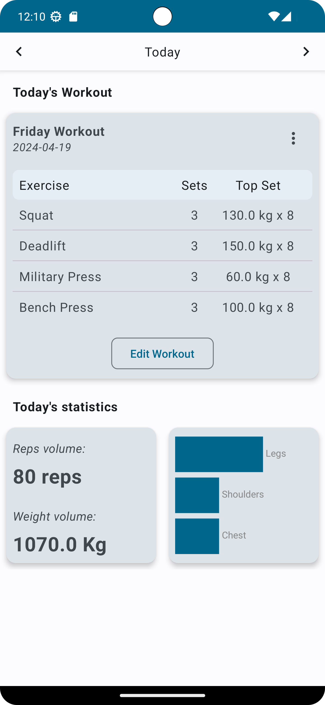
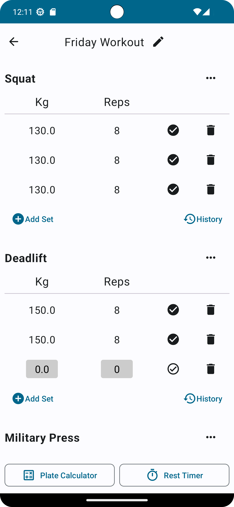
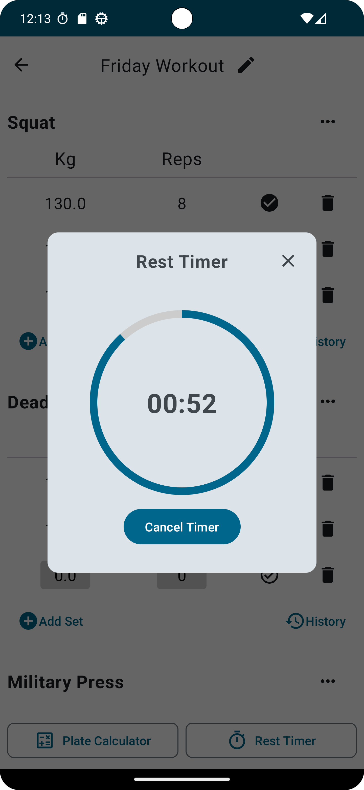
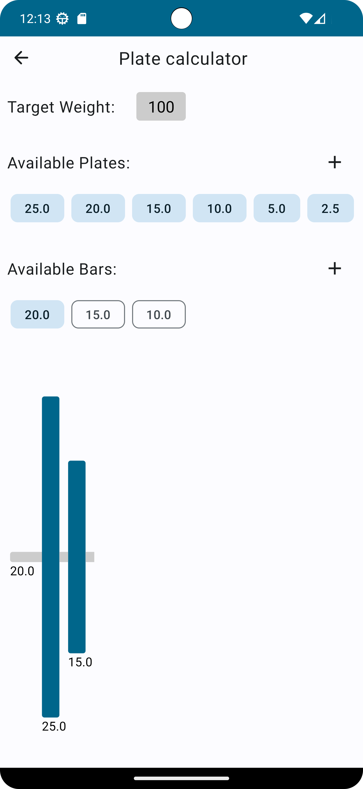
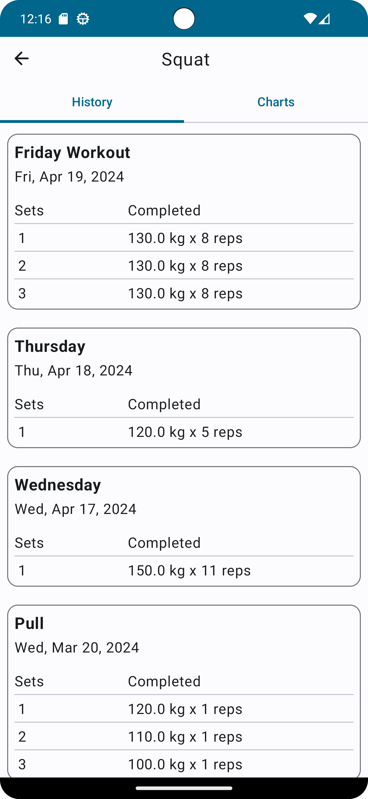
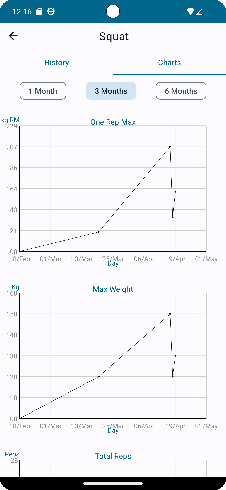

# GymTracker
App to keep track of your gym progress

## Tech stack & used libraries

- Kotlin based, utilizing Flows & Coroutines for asynchronous operations.
- Jetpack Libraries:
  - Jetpack Compose
  - Viewmodel
  - Room
  - Preferences Datastore
  - Hilt
  - Navigation
  - Lifecycle
- Architecture:
  - MVVM
  - Repository Pattern

## Screenshots

| Main Screen  | Workout Diary | Rest Timer |
| ------------- | ------------- | ------------- |
|   |   |   |

| Plate Calculator  | History Screen | History Charts |
| ------------- | ------------- | ------------- |
|   |   |   |
